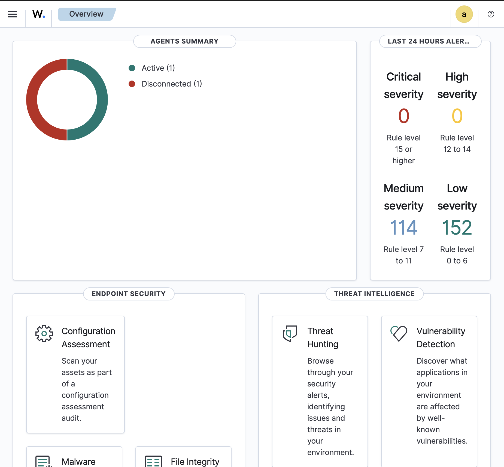
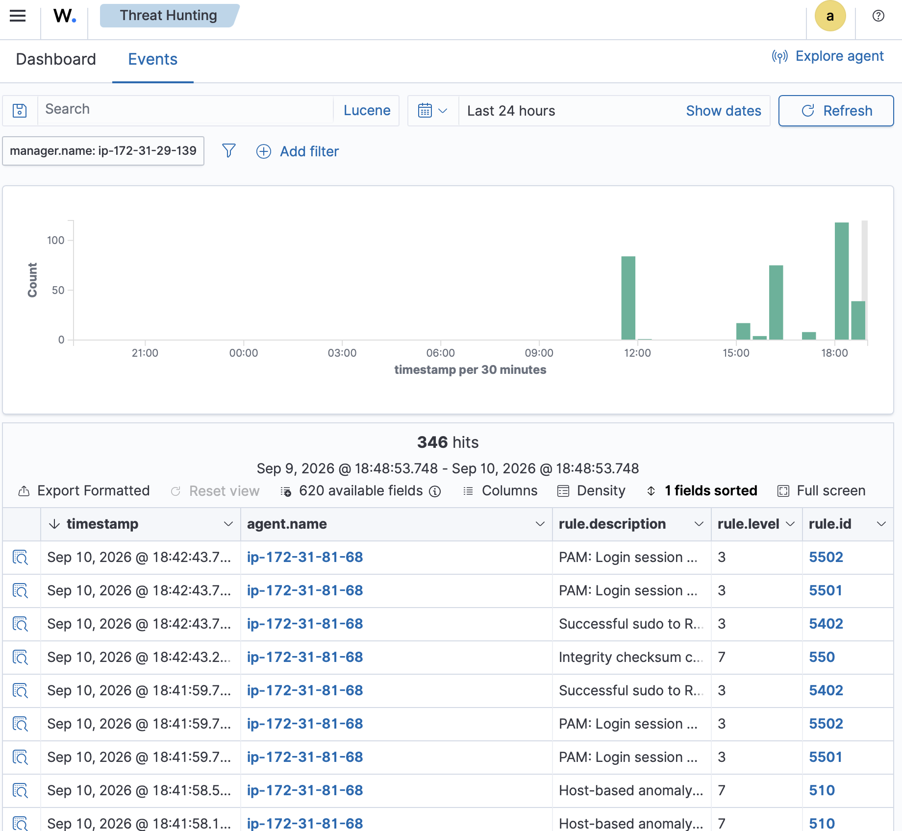
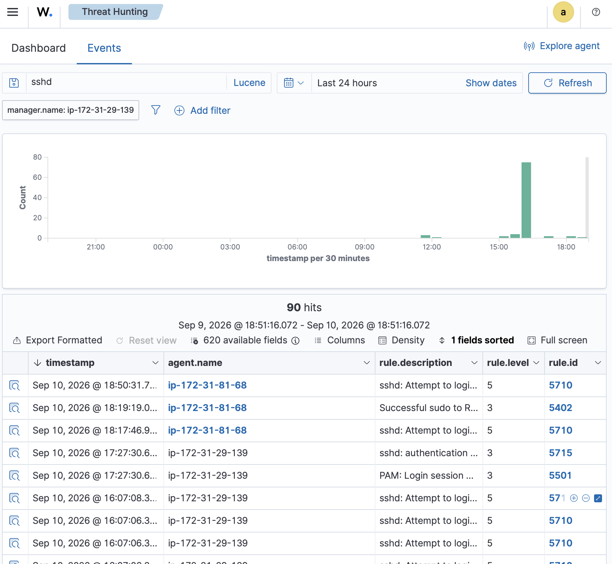
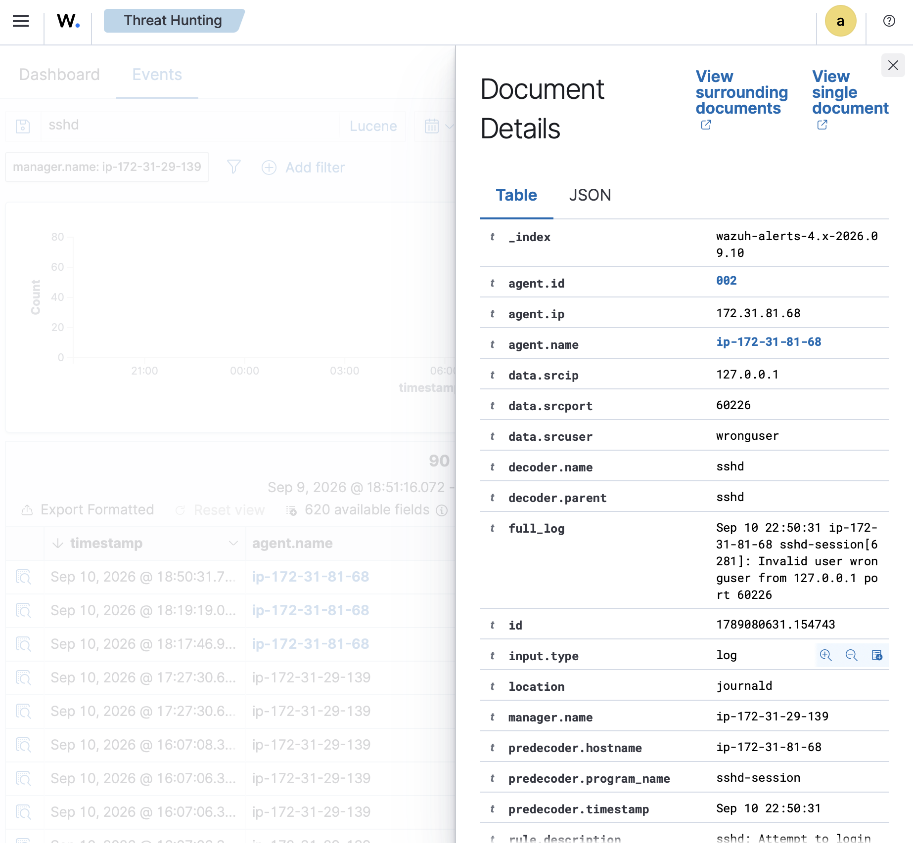
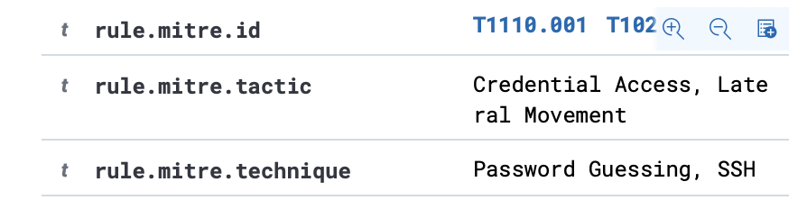

# Screenshots

Evidence collected during the AWS Wazuh SIEM lab.

## Wazuh Agent Connected

## File Integrity Monitoring

## Failed SSH Login Detection

## SSH Alert Investigation

## MITRE ATT&CK Mapping

